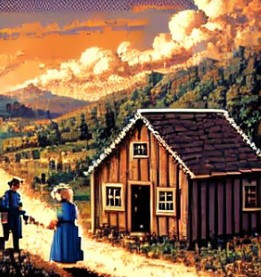
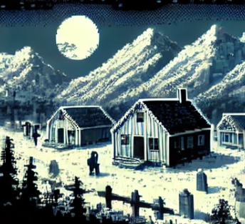
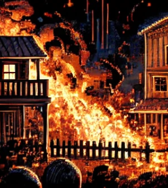
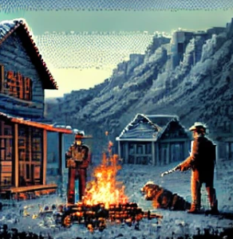
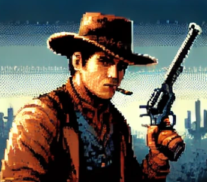
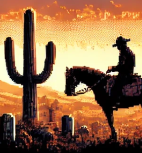
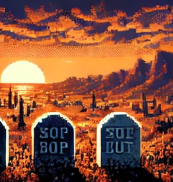
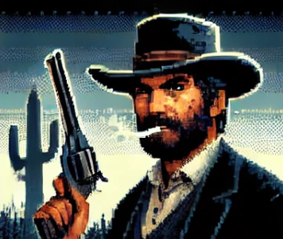

# 2D Western Duel Game (8-bit Style)

Create a simple, engaging, and fun 2D Western duel game in 8-bit style.

## Game Setup
- Place the playable character on the left side of the screen
- Position the computer-controlled opponent on the right side

## History

A long time ago, in the middle of nowhere, the peace of the people was quiet and peaceful. But, suddenly, everything changes.

Humble folk suffered at the hands of outlaws. Robbery, murder, and countless other crimes 
plagued the daily lives of these poor people.

One day, a gang of the most dangerous and ruthless men, known as the "Dried Gut," attacked a farming village, killing the men and abducting the women and children. 

Amidst the chaos of these brutal assaults, one family was slaughtered—the family of a retired gunslinger. 

That day, the Dried Gut gang made a fatal mistake.

The gunslinger vowed revenge—deadly revenge.

### Ending

After a bloody journey of retribution, the gunslinger finally fulfilled his promise, and the entire Dried Gut gang was defeated. 

At last, his family could rest in peace...

and once more, his guns were laid to rest.

Song: assets/sounds/the_final_sunset.mp3

Pixelated Showdown

The end.

## Gameplay

### Duel Initiation
1. The game start when player press enter to start message
2. Trigger the duel with a countdown, start at 3,2,1...

### General mechanics
1. Every chapter increase a combination.
2. The player has a 3 bars of life, if he loose his 3 bar, is game over.
3. Every enemy has a different level of bars.

### Duel Mechanics
1. Display a random arrow key combination (e.g., "←↑→↓") on the right side of the screen
2. Generate a unique combination for each duel.
3. Show a progress bar below the arrow combination
4. The player must input the correct combination before the progress bar depletes

### Level Mechanics
1. The levels in the game are called Chapters.
2. There's Eight Chapter
3. Every chapter increase dificulty
4. When the player won the enemy at eight chapter, he win the game.

### Enemy Mechanics

1. Every enemy has a different graphic design.
2. Every enemy has a different life bar count.
3. Every enemy has a different combination keys sequence.

### Enemies

1. Chapter I - Little Bit
  * 2 life bar
  * 4 combination keys
2. Chapter II - Brain Splitter
  * 2 life bar
  * 4 combination keys
3. Chapter III - Slaughterhouse
  * 4 life bar
  * 6 combination keys
4. Chapter IV - Boot
  * 4 life bar
  * 8 combination keys
5. Chapter V - Few Locks
  * 4 life bar
  * 8 combination keys
6. Chapter VI - Dry Lagoon
  * 6 life bar
  * 8 combination keys
7. Chapter VII - Little Chinese
  * 6 life bar
  * 8 combination keys
8. Chapter Final - Dried Gut
  * 8 life bar
  * 12 combination keys

### Win/Lose Conditions
1. **Player wins if:**
  * The correct combination is entered before the progress bar depletes.
2. **Player loses if:**
  * An incorrect combination is entered.
  * The progress bar depletes before the correct combination is entered.
3. **Duel End Condition:**
  * The duel is ended when the life bar of either the player or the enemy is depleted.

## Audio
1. Include a Western spaghetti 8-bit soundtrack playing in the background located at assets/sounds/background_music.mp3
2. The shoot sound: assets/sounds/shoot.wav
3. When a duel starts: assets/sounds/start.wav
4. When the player won: assets/sounds/win.wav
5. When the player lose a life bar: assets/sounds/dead.wav
6. When the player lose all life bar and the game is over: assets/sounds/game_over.wav
7. When the player finish the game: assets/sounds/the_final_sunset.mp3

## Visual Style
- Use 8-bit graphics for all game elements
- Use a western style in all graphics elements